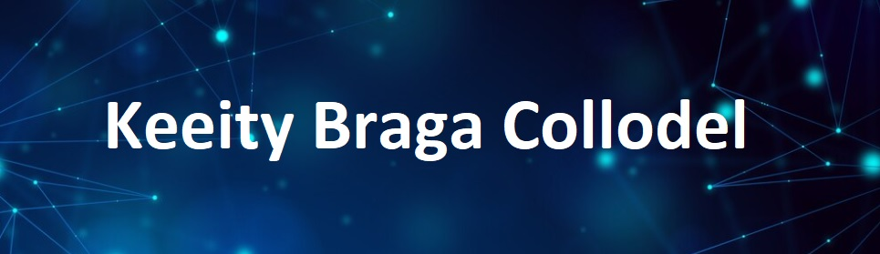

</img>

### 🙋‍♀️: &nbsp;Sobre

&nbsp;&nbsp;&nbsp; Tenho 37 anos, sou nascida em Curitiba e moro em Florianópolis há 4 anos  (atualmente, no Campeche!).  Sou formada em Direito e também em artes cênicas na UFPR . Passei no concurso de advogado da Caixa Econômica, e, há 5 anos, assumi função gerencial, no setor jurídico. Comecei a me aventurar na área de tecnologia para buscar maior controle de gestão e otimização de rotinas, mas cada vez mais tenho me apaixonado pela programação. Comecei pelo excel e VBA, depois banco de dados e SQL, e, recentemente, PowerBI. Além disso, há alguns meses, tinha começado a estudar Java e Android Studio porque gostaria de aprender a fazer aplicativos. Neste ano (2024), estou cursando o FutureDev FMT, para ser prorgramadora Full Stack, com conhecimentos de javascript, HTML e CSS, com utilizaçao de node, react, dentre outros!\

  &nbsp;&nbsp;&nbsp;&nbsp;
  &nbsp;&nbsp;&nbsp;&nbsp;
  &nbsp;&nbsp;&nbsp;&nbsp;

  

    <b>:computer: &nbsp;Principais conhecimentos na área de tecnologia  </b> - Clique para ver os detalhes
     

   
&nbsp; 
&nbsp;
&nbsp
&nbsp;
&nbsp;
&nbsp 
&nbsp;
&nbsp;
&nbsp;
&nbsp;
&nbsp; 
&nbsp;
&nbsp;
&nbsp;
&nbsp;

  

    <b>⚖️: &nbsp;Conhecimentos na área do Direito: </b> - Clique para ver os detalhes
  

   

&nbsp;
&nbsp;
&nbsp;
&nbsp; 
&nbsp;
&nbsp;

  

    <b>👩🏻‍💻: &nbsp;Conhecimentos na área do Gestão: </b> - Clique para ver os detalhes
  

   

&nbsp;
&nbsp;
&nbsp;
&nbsp;
&nbsp;

  

    <b>:gear: &nbsp;Estatisticas do GitHub</b> - Clique para ver os detalhes
  

   
    

        
    

    

         
    

 

